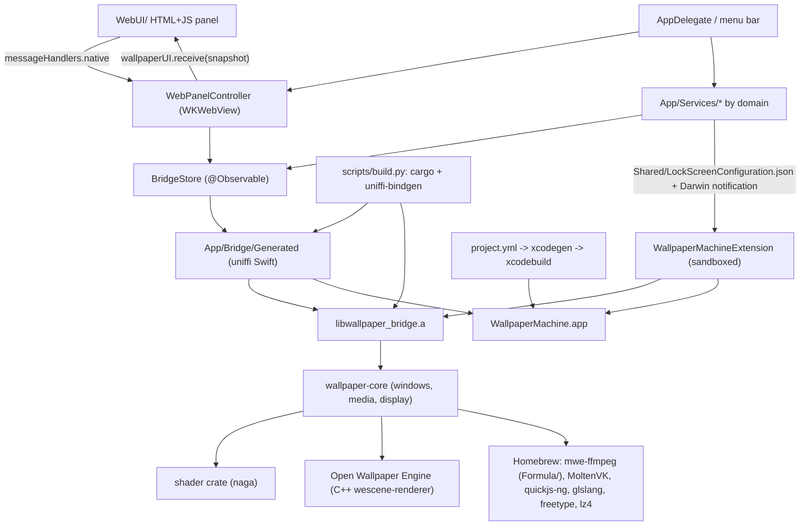

# Architecture

WallpaperMachine is a native macOS wallpaper client built on a vendored Rust/C++ renderer.
It ships as one application bundle that embeds one ExtensionKit extension, and it links a Rust
static library that in turn statically links a C++ scene renderer.

For the directory map and where new code belongs, see [repository-layout.md](repository-layout.md).

This document is long because it spans four runtimes. Read the section you need
rather than the whole file:

| Section | Read it when |
|---|---|
| [Layers](#layers) | Orienting for the first time; each subsection below stands alone |
|  [AppKit shell](#appkit-shell) | Touching app startup, windows or the status item |
|  [Control panel: WKWebView and the JavaScript bridge](#control-panel-wkwebview-and-the-javascript-bridge) | Changing `WebUI/`, the message bridge, CSP or asset allowlisting |
|  [Observable state](#observable-state) | Adding state that views or the panel observe |
|  [Service layer](#service-layer) | Adding domain logic, networking or persistence under `App/Services/` |
|  [Desktop wallpaper windows and private-API handling](#desktop-wallpaper-windows-and-private-api-handling) | Working on wallpaper presentation, Spaces or displays |
|  [Renderer bridge (generated uniffi)](#renderer-bridge-generated-uniffi) | Changing the Swift↔Rust boundary or regenerating bindings |
|  [Rust crates and the C++ scene engine](#rust-crates-and-the-c-scene-engine) | Working inside `upstream/renderer` |
|  [Lock-screen extension](#lock-screen-extension) | Touching `Extension/` or `Shared/` |
| [Build-time dependency chain](#build-time-dependency-chain) | A build fails or you add a dependency |
| [Ours versus vendored](#ours-versus-vendored) | Deciding whether a change belongs in `upstream/` |
| [Homebrew linkage and bundling](#homebrew-linkage-and-bundling) | Diagnosing dylib, rpath or packaging problems |
| [Targets](#targets) | Adding a target or moving a file between them |
| [Runtime and build relationships](#runtime-and-build-relationships) | Tracing what talks to what at runtime |
| [Invariants and constraints](#invariants-and-constraints) | Before changing anything structural — these are the rules |
| [Where to look](#where-to-look) | You know the symptom but not the file |

## Layers

### AppKit shell

`App/WallpaperEngineApp.swift` is the `@main` entry point. It is plain AppKit: it creates
`NSApplication`, installs `AppDelegate`, and runs the loop — there is no SwiftUI `App` scene.
The internal `--wallpaper-import-picker` mode instead runs `WallpaperImportPickerHelper`
before `AppDelegate`: it presents a native picker in the current app language and returns
URLs to the parent without starting wallpapers or library services.

`App/AppDelegate.swift` owns process lifecycle: it configures the Vulkan ICD
(`App/Bridge/BridgeEnvironment.swift` points `VK_ICD_FILENAMES` at the bundled
`MoltenVK_icd.json`), prepares the app-support tree (`ClientPaths.prepare()`), constructs
`BridgeStore`, installs the menu-bar status item and application menu, observes
`NSApplication.didChangeScreenParametersNotification`, opens the control-panel window, and
drives an ordered asynchronous shutdown (lock screen, desktop poster sync, SteamCMD setup,
downloader, then the renderer bridge). The app runs in `.accessory` activation policy while no
control-panel window is visible and switches to `.regular` when one is. The status item's menu
offers Control Panel, Play/Pause while something is active, **Next Wallpaper** (on the panel's target
display: the playlist's next when that display rotates, otherwise the next playable library wallpaper in
library order; `PlaylistScheduler.skip`, `BridgeStore.nextWallpaperID`),
**Lock Screen** (the private `SACLockScreenImmediate` in login.framework, resolved with `dlsym` and
left out when missing; `App/Services/Desktop/ScreenLock.swift`) and Exit. The application menu
bar holds the app menu (Settings…, Check for Updates…, Quit), **File → Close** (Command-W, which
reaches `windowShouldClose` and hides the control panel exactly as its close button does) and
**Edit** (text editing). Under a hosted test run
(`NSClassFromString("XCTestCase") != nil`) the delegate short-circuits: no services are created
against the user's real app-support folder.

An explicitly opened `WallpaperPreviewWindowController` keeps the app in regular
activation policy as well. Its `WallpaperPreviewSession` owns one separate WebKit
page or Compatibility renderer, never an engine display assignment. The read-only
bridge preview descriptor exports draft inputs; the App target's
`App/Bridge/WallpaperPreviewBridge.h` imports the existing scene C API for a normal
`CAMetalLayer` view. Preview shutdown precedes app renderer shutdown. See
[live preview](features/control-panel.md#live-preview) for its playback limits.

### Control panel: WKWebView and the JavaScript bridge

The control-panel UI is HTML/CSS/JS in `WebUI/`, bundled as the app resource folder `WebUI`.
Swift hosts it, but the page is app-owned: the renderer never draws into this web view.

| Piece | Responsibility |
|---|---|
| `App/Views/ControlPanel/ControlPanelView.swift` | SwiftUI container; `ControlPanelNavigation` (`SidebarSelection`, `targetDisplayID`, Settings section) shared with native menu commands |
| `App/Views/ControlPanel/WebControlPanel.swift` | `NSViewRepresentable` over `WKWebView`; `WebPanelController` coordinator, `WebPanelAssets` scheme handler, message proxy |
| `App/Views/ControlPanel/WebPanelSnapshot.swift` | Builds the single `[String: Any]` state payload handed to the page |
| `App/Views/ControlPanel/WebPanelActions.swift` | Decodes and executes page-originated actions (`WebPanelRequest`) |
| `WebUI/index.html`, `panel.js`, `settings.js`, `welcome.js`, `theme.js`, `panel.css`, `settings.css`, `welcome.css` | The page itself; `welcome.js` is the full-window first-run guide |
| `WebUI/icons.js` | Vendored [Lucide](https://lucide.dev) glyphs (ISC) behind the page's `icon(name)` helper |

Protocol, both directions:

- **Assets.** `WebPanelAssets` is a `WKURLSchemeHandler` for the private `mwe-ui` scheme. The
  page loads from `mwe-ui://app/index.html`, and only allowlisted bundled assets are served.
  Wallpaper previews are served as `mwe-ui://preview/<wallpaperID>` from a per-snapshot allow
  list, so no library path is exposed to the page. `index.html` additionally carries a
  restrictive CSP (`default-src 'none'`, `connect-src 'none'`).
- **Swift to page.** `WebPanelController.snapshot()` produces one dictionary describing the whole
  UI (page, library, displays, options, settings, workshop, SteamCMD setup, downloads, import
  status, theme, GitHub update state), delivered by `callAsyncJavaScript("return window.wallpaperUI.receive(state)")`.
  Updates are coalesced through `scheduleUpdate()` and suppressed entirely while the window is
  hidden, miniaturized or occluded. Observation is installed with
  `withObservationTracking { trackSnapshotDependencies() }`, so any observed store property that
  the snapshot reads re-arms an update.
  The library rows are cached by their own inputs and carry `libraryRevision`.
  The first delivery and action replies include the complete list; progress-only
  pushes omit unchanged rows. The page reuses only a matching revision, otherwise
  requests a full snapshot through the delivery result. Reloading the document
  resets that agreement. Metadata, assignments, target display, energy ratings,
  update availability and language changes invalidate the cached rows.
  The one exception is the Settings energy readout, pushed every two seconds as
  `window.wallpaperUI.energy(reading)` so it patches its own row instead of re-rendering the
  panel. Sampling runs only while the window is visible on Settings. See
  [features/performance.md](features/performance.md#energy-use). Separately, the app
  delegate's `WallpaperEnergyRecorder` samples every 30 s while one wallpaper plays alone
  with the panel off screen and keeps per-wallpaper ratings in `<support>/EnergyRatings.json`;
  library items carry them as `energy`, read with the rest of the snapshot. See
  [per-wallpaper energy rating](features/performance.md#per-wallpaper-energy-rating).
- **Page to Swift.** `panel.js` calls `window.webkit.messageHandlers.native` with an `action`
  string plus arguments. The handler is a `WKScriptMessageHandlerWithReply`, so every action is
  answered with either a fresh snapshot or an error string. `WebPanelController.receive` rejects
  any message that is not from the main frame of the `mwe-ui://app` origin.
  Do not post actions from the render path. An earlier version posted the visible Settings tab from
  `settings.js` `draw()`, i.e. while rendering a native push, and hung the offscreen
  `ControlPanelSyncTests`/`ControlPanelShellTests` panel suites until their time limit; the
  cause was not isolated.
  `send()` marks an action pending under a key that covers every tab (and every value of one
  property), and a repeated `navigate`, `property` or similar action waits on the one in flight.
  Anything that can throw between marking it and posting it belongs inside the `try` that
  releases the key: a busy render that threw there once left the key pending with nothing in
  flight, and the next tab click re-sent itself in an endless microtask loop that froze the page
  (issue #30).
- **Theme.** `theme.js` reads `window.__appTheme`, injected as the panel's only `WKUserScript` at
  document start so the resolved appearance is correct before first paint;
  `window.appTheme.apply(theme)` is called on every snapshot.
- **Recovery.** `webViewWebContentProcessDidTerminate` permits three automatic restarts
  within 120 seconds, then surfaces a native `NSAlert` with a Reload action. A ready
  handshake alone does not restore the budget; 60 seconds of stable operation does.
  Navigation policy allows only the index URL; external
  links are filtered by `WebPanelController.allowedExternalURL`.

### Observable state

`App/ViewModels/BridgeStore.swift` is the `@MainActor @Observable` facade over the renderer. It
holds the `WallpaperBridge` handle and the cached snapshot values (`appSnapshot`,
`librarySnapshot`, `wallpaperOptionsSnapshot`, `monitorInformationSnapshot`, `settingsSnapshot`,
`snapshotRevision`, `libraryLoadState`), exposes async mutation calls, and publishes
`onSnapshotApplied` so `AppDelegate` can re-evaluate presentation policy and lock-screen state.
User commands from the panel and the menu bar run one at a time through `BridgeStore.commands`
(`App/ViewModels/UserCommandQueue.swift`). A command given while another runs waits its turn
instead of failing; commands sharing a slot (selecting a wallpaper, switching one display's
wallpaper) keep only the newest waiting request, so rapid clicks apply the last choice. Favorite
and Show in Finder skip the queue, and delete confirmations are asked before queueing. The panel
marks the tile being applied and any queued behind it; busy is never shown as an error. Callers
outside the queue (downloads, imports) that reach an activation-guarded store call wait for the
running apply rather than throw.
`App/ViewModels/WallpaperEditorState.swift` holds transient editor drafts (scaling text,
property text, expanded sections) that must not be pushed into the renderer on every keystroke.
`App/Logging/AppLog.swift` writes Swift log lines straight into the bridge's log from any thread, holding
those logged before the bridge exists; see [Logs and diagnostics reports](features/diagnostics.md).

### Service layer

Services are grouped by domain under `App/Services/`.

| Domain | Types | Responsibility |
|---|---|---|
| `Appearance/` | `AppTheme` (`AppThemePreferences`, `AppThemeStore`) | Mode/accent/tone preferences shared by AppKit and the page |
| `Desktop/` | `DesktopSpaceWallpaperAPI`, `DesktopWallpaperLedger`, `DesktopWallpaperSync`, `PlaybackPreferences`, `AppRuleMonitor`, `OtherAudioMonitor`, `SystemConditionMonitor`, `FocusFilterState`, `WallpaperPresentationPolicy`, `WallpaperCoverageProbes` | Per-Space desktop picture control, original-wallpaper journal, still-poster sync, playback rules (apps, other audio, Low Power Mode, heat, Focus filter), per-display renderer suspension |
| `Automation/` | `AutomationCommand`, `AppAutomation`, `HotKeyPreferences`, `GlobalHotKeys`, `WallpaperIntents`, `WallpaperConfigurationIntents`, `WallpaperFocusFilter`, `WallpaperAutomationStore/Planner/Scheduler/Controller`, `WallpaperSolarTimes` | Explicit commands through `AppDelegate.performAutomation`; per-display weekday/solar/appearance rules and temporary Focus selections through the shared command queue, with local recovery and manual-choice precedence; see [features/automation.md](features/automation.md) |
| `Playlist/` | `WallpaperPlaylist`, `PlaylistPlanner`, `PlaylistStore`, `PlaylistScheduler` | Per-display rotation and day and night wallpapers, switched through the display's command slot while playback runs; see [features/playlists.md](features/playlists.md) |
| `GitHub/` | `GitHubReleaseClient`, `AppUpdateModels`, `AppUpdateStore`, `AppUpdateInstaller` | GitHub Releases update check, download, in-place install |
| `Library/` | `ClientPaths`, `WallpaperImportService`, `LibraryImportStore`, `StillImageWallpaper`, `WallpaperDeletionService` | App-support layout, non-destructive import (run for the app, not the panel page, so Finder and Dock drops import too), still pictures packaged as `web` wallpapers, guarded deletion |
| `LockScreen/` | `LockScreenWallpaperSelection`, `LockScreenWallpaperService` | System lock-screen selection overrides and configuration publishing |
| `Pixiv/` | `PixivService`, `PixivTransport`, `PixivStore`, `PixivSessionStore`, `PixivDownloadQueue`, `PixivWallpaperPackager` | pixiv rankings and tag search, the signed-in session (keychain, sent to `www.pixiv.net` only), downloads of originals and their packaging as still `web` wallpapers; see [features/pixiv.md](features/pixiv.md) |
| `Steam/` | `SteamCMDRuntime`, `SteamCMDSetupStore` | SteamCMD discovery, download, validation, security approval |
| `Workshop/` | `WorkshopService`, `WorkshopSource`, `WorkshopStore`, `WorkshopDownloader`, `WorkshopDownloadManager`, `WorkshopThumbnailCache`, `WorkshopUpdateStore` | Workshop query model, browse state, Discover's other sources (collections, an author's items, and subscriptions read with an in-memory Steam Community session), SteamCMD-driven downloads, concurrent download queue sharing one saved sign-in, one-download on-disk previews (still + animation) for Discover tiles, warmed ahead of the panel, updates of installed items found through Steam's public details endpoint |
| `WebWallpaper/` | `WebWallpaperHost`, `WebWallpaperWindow`, `WebWallpaperPage` | Desktop-level `WKWebView` windows for `type: "web"` projects, driven by the bridge's `webWallpapers()`; see [features/web-wallpapers.md](features/web-wallpapers.md) |

`ClientPaths` fixes the on-disk contract: everything lives under
`~/Library/Application Support/WallpaperMachine` (overridable with
`WALLPAPER_MACHINE_HOME`) with `Library/`, `SceneAssets/`, `SteamCMD/` beneath it, and it
exports `WALLPAPER_MACHINE_SUPPORT_ROOT`, `_LIBRARY_ROOT` and `_ASSETS_ROOT` so the Rust side
resolves the same paths.

### Desktop wallpaper windows and private-API handling

Live desktop wallpaper windows for scene and video projects are created by the Rust core, not
by Swift: `upstream/renderer/crates/core/src/window.rs` defines the `NSWindow` subclass
`MWEWallpaperDesktopWindow` (stable Objective-C name, deliberately depended on by Swift) hosting
a `CAMetalLayer` at a wallpaper window level. Web projects get the same window shape from Swift
(`MWEWebWallpaperDesktopWindow`, `App/Services/WebWallpaper/`); the bridge excludes them from
engine reconciliation and reports them through `webWallpapers()`. Every wallpaper window kind
(renderer, web, native video) sets `canHide = false`: hiding the app — Cmd-H, or the panel
hiding itself after an activation — hides the panel only. With AppKit's default the wallpaper
windows left the screen too, and occlusion suspended every display.

Multi-display user commands are coordinated above these windows by
`WallpaperDisplayTransfer` and `BridgeStoreDisplayLayouts`: saved arrangements,
copy and swap validate all screen/content references, hold one user-command turn,
and verify recovery after failure. `WallpaperDisplayLayoutStore` owns only saved
wallpaper choices; playlists, properties and display topology remain with their
existing owners. See [display layouts](features/display-layouts.md).

Swift keeps the *system* wallpaper consistent with that window:

- `DesktopSpaceWallpaperAPI` `dlopen`s CoreGraphics and HIServices and resolves
  `_CGSDefaultConnection`, `CGSCopyManagedDisplaySpaces`, `DesktopPictureCopyDisplayForSpace` and
  `DesktopPictureSetDisplayForSpace`. Every symbol is optional: the initializer fails and the
  caller falls back to the public `NSWorkspace` API, which is scoped to the visible Space.
- `DesktopWallpaperLedger` journals the user's original per-Space `DesktopPicture` (including the
  opaque native options blob) before anything is replaced, so the original wallpaper can be
  restored. A pathless (inherited) selection or a poster cannot bring the user's wallpaper back,
  because what it inherits from shows posters too. Before any write, the ledger resolves each
  display's first real per-Space original, then its effective image through `NSWorkspace`, then
  its saved journal (finally another display's original). An inherited desktop or unjournaled
  poster uses that snapshot. With no recoverable original, it leaves the system selection
  untouched and reports the failure through `AppLog`; live playback continues without new
  posters. An older journal containing only empty originals cannot recover the user's previous
  choice: the user must select it again in System Settings. It deletes posters no readable
  desktop shows, keeping only the newest few on a display where some desktop could not be read.
- `DesktopWallpaperSync` encodes real renderer output into a JPEG poster
  (`DesktopPosterEncoder`) under `<support>/DesktopPosters`, so the static system wallpaper
  (what Mission Control shows) matches the animated one. A new or changed wallpaper is captured
  at once and again 3 s and 15 s later (`settleCaptureDelays`), as is one that resumes after a
  pause, a cover or display sleep, so intros and settings that take a moment to show reach the
  poster. A Space change or wake applies the existing poster at once and asks for a fresh frame.
  **Settings › General › Update the Mission Control picture every 5 minutes**
  (`PlaybackPreferences.refreshesDesktopPicturePeriodically`, off by default) adds a capture every
  `periodicRefreshInterval`. Settling and periodic captures ask only displays the presentation
  policy has not suspended, and a frame identical to the current poster costs a readback and a
  hash: it is not encoded again, and unchanged target pictures are not rewritten.
  The experimental [Space selection mode](features/spaces.md) uses `WallpaperSpaceMonitor`
  UUID/visit context on every immediate, settling and periodic request. Producers echo
  the original context and the coordinator rejects late frames/encodes. A fresh response
  with identical pixels can reuse the encoded image for a new Space. Its ledger writes
  only the active native Space and retains inactive posters through replacement gaps.
  Public fallback targets have no Space identity and cannot accept scoped writes.
  A desktop macOS keeps refusing (`DesktopWallpaperLedger.refusalsBeforePause`
  writes in a row, the initial one plus the quick retries) is left alone until the next Space
  change or wake rather than rewritten on every snapshot. It suspends itself while the native
  lock-screen provider owns the desktop. On quit, the native service restores its selections
  before the poster service restores originals. The latter checks image references in the
  native store read-only, retains still-referenced posters and their journal entries across
  WallpaperAgent reloads, and retries asynchronous restoration for about five seconds. Failure cancels quit before
  other services are torn down; provider callbacks cannot discard the restorer during quit.
  A cancelled quit immediately restarts poster synchronization if the native provider has
  released the desktop, without waiting for another wallpaper or settings change.
- `WallpaperPresentationPolicy` suspends or unloads presentation when no wallpaper pixel can reach a
  display, without altering the user's play/pause choice. The strongest global condition wins:
  display sleep pauses (`setPresentationSuspended`) or stops and frees renderer memory
  (`setPresentationUnloaded`) per `PlaybackPreferences.displaySleepAction`; session lock, an active
  pause rule, or other-app audio set to pause suspend; an active stop rule unloads.
  `AppRuleMonitor` and `OtherAudioMonitor` feed those conditions, and wallpaper audio is suppressed
  separately (`setAudioSuppressed`) for a mute rule or other-app audio set to mute. Occlusion stays
  per display via `setDisplayPresentationSuspended`, so one covered screen stops only its own
  decoding, simulation and rendering and a visible screen never resumes a covered one. With
  `PlaybackPreferences.desktopCoveredAction` at its default, pause, a display whose working area
  other windows cover counts as hidden too: `WallpaperCoverageProbes` keeps one alpha-0,
  mouse-transparent window per display just above the wallpaper level, over `visibleFrame` inset
  by 32 pt, and the policy reads its occlusion, because the strip under the menu bar and a zoomed
  window's corners keep AppKit reporting the wallpaper window itself visible. The bridge
  keeps `suspended_displays` beside the global flag, resolves each scene's and web descriptor's
  paused state from its own display, and re-applies the still-hidden displays after a global resume.
  System audio capture follows visible consumers — a presenting scene with audio response
  enabled — rather than the global pause flag.
- Screen-parameter changes refresh displays through `DisplayRefreshCoalescer`: one refresh runs
  at a time and a burst that arrives meanwhile, as a waking display posts, gets one more. A
  refresh reopens a scene only when its saved configuration changed. The frame-rate ceiling, the
  transient mute, pause and the gating of system-audio capture are applied live and never count
  as a different wallpaper; a scene's own audio-response switch follows the saved setting even
  while capture waits for the scene to read audio. Every reconcile (Apply, a display edit, a
  video-backend switch, a repair) hands the engine each scene with the frame-rate ceiling and the
  transient mute already applied, the form an open scene's descriptor holds, so it too reopens
  only the scenes whose saved configuration changed.
  Window-only updates compare the native geometry before writing it: moving a display or
  changing the primary display does not force a window redraw or reset an unchanged Metal
  drawable size. Geometry changes commit without implicit layer animations, retaining the
  existing surface while sleep/wake topology settles rather than exposing its placeholder.
  If a drawable is nevertheless unavailable or recreated, the renderer window and
  Metal layer use opaque black rather than white. This matches the native-video
  and web hosts; it reduces the brightness of an unavoidable gap without changing
  wallpaper pixels or promising a seamless macOS sleep/wake transition.

### Renderer bridge (generated uniffi)

`App/Bridge/Generated/` holds `WallpaperBridge.swift`, `WallpaperBridgeFFI.h` and
`WallpaperBridgeFFI.modulemap`, generated by `uniffi-bindgen` from the Rust
`wallpaper-bridge` crate. Swift sees a `WallpaperBridge` object plus the `Bridge*` value types
(`BridgeAppSnapshot`, `BridgeLibrarySnapshot`, `BridgeSettingsSnapshot`,
`BridgeWallpaperOptionsSnapshot`, `BridgeMonitorInformationSnapshot`, `BridgePropertyDescriptor`,
`BridgeScalingMode`, `BridgeLockScreenScene`, `BridgeError`, …). The `WallpaperMachine` and
`WallpaperMachineTests` targets consume it through `SWIFT_INCLUDE_PATHS`,
`HEADER_SEARCH_PATHS` and `-Xcc -fmodule-map-file=…/WallpaperBridgeFFI.modulemap`; the two
generated FFI files are excluded from the compile sources list and reached through the module map
instead.

Every snapshot the bridge returns carries the launch-at-login status, which `LaunchAtLoginController`
reads from `SMAppService`, a round trip to the system's service manager. It keeps a read for two
seconds: a burst of snapshots asks once, a change made through the bridge is current at once, and
one made in System Settings shows on the first snapshot after the last read has aged.

### Rust crates and the C++ scene engine

`upstream/renderer` is a Cargo workspace (`resolver = "2"`, edition 2024, GPL-2.0-only) with
three members:

| Crate | Output | Role |
|---|---|---|
| `crates/bridge` (`wallpaper-bridge`, lib name `wallpaper_bridge`) | `staticlib` + `rlib`, plus the `uniffi-bindgen` binary | uniffi API surface (`api/`), kameo actor (`actor/`), engine facade (`engine/`), config store, library scanner, display rows, logging, login item, power |
| `crates/core` (`wallpaper-core`) | `rlib` | Runtime state machine: scene reconciliation, display discovery and watching, wallpaper windows, media decode (`media/video`, `media/audio` capture for audio response), render cache, and the `owe` FFI wrappers |
| `crates/shader` (`shader`) | `rlib` + `staticlib` | GLSL parsing/translation via `naga`, exposed to C++ through the `ffi` feature |

`crates/core/build.rs` drives the C++ layer: it runs `bindgen` over
`upstream/renderer/external/open-wallpaper-engine/src/Platform/Apple/SceneWallpaperBindings.h`,
then CMake-builds the `wescene-renderer` target of Open Wallpaper Engine with `BUILD_TESTING`
and `BUILD_TESTS` off and `RUST_SHADER_FFI` on, and emits the
static link flags. Open Wallpaper Engine stays a statically linked renderer backend: its Rust
wrapper module (`core/src/owe/`) must not own scene registries or display maps.

Per-display configuration (`[[monitors]]` and `[[monitor_settings]]` in `config.toml`) is keyed
by a selector: the primary display, a live display id, or an identity (UUID, vendor, model,
serial, unit number, name). `DisplayIdentity::match_score` in core is the one rule for whether an
identity names a display. A UUID both sides carry decides on its own, then vendor, model and
serial; the unit number is a last resort that never overrides a UUID or serial that disagrees.
macOS renumbers displays and renames identical models ("Name (1)", "Name (2)") across reboots and
reconnects, so display sync (`AppConfig::sync_known_monitors`) keeps one block per display,
renamed to its current selector, and settings entries and mirror targets follow.

Pointer polling follows committed native scene capability, not a manifest or a
first-frame notification. Pure video projects publish no pointer consumer;
ordinary and not-yet-committed scenes remain conservative, and a paused scene
(user, policy or its own display covered) is not a consumer. A bounded,
event-driven relay carries a retained renderer-instance identity into the core
actor. Snapshot publication serializes consumer notifications with button-edge
activation, while the bridge combines consumer presence with pause policy for
its single-in-flight poller. The poller is event-armed: the engine's global and
local `NSEvent` monitors (buttons, moves, drags) mark it dirty, as do a new
consumer, a resume and a reset of a runtime's pointer delivery, and it samples
at most once per 16 ms, at once after a quiet stretch. While the app is active,
or when a monitor could not be installed, it probes the cursor with
`CGEventCreate` every 16 ms instead and skips the actor round trip when nothing
changed. One sample delivers enter, position and ordered button transitions in
one actor turn. Successful identical position/enter writes are deduplicated;
native per-frame camera/content mapping and hit dispatch still run. A level-only
button baseline reconciles a newly committed consumer without inventing presses
or replaying video-period taps. These are Rust/native runtime contracts, not
persisted or uniffi snapshot fields.

Each renderer also reports whether its committed scene reads system audio (an
audio-processing material or particle emitter, a `g_AudioSpectrum*` uniform, or
`registerAudioBuffers`) through `owe_scene_wallpaper_set_audio_requirement_callback`.
The report travels like pointer capability: a latest-value relay per renderer
object into the core actor, an observer on snapshot publication, and a bridge
relay that re-registers the handle and re-evaluates capture. The system-audio
tap runs only for `audio_response_enabled && scene reads audio && !paused`, or
for a subscribed web page, so plain video wallpapers never open it.

### Lock-screen extension

`Extension/` builds `WallpaperMachineExtension`, an `extensionkit-extension` target for the
`com.apple.wallpaper` extension point (`Extension/Info.plist`). It is a separate, sandboxed
process; the app cannot call into it directly.

| File | Responsibility |
|---|---|
| `WallpaperExtension.swift` | `@main AppExtension`; XPC handler for `acquire`/`update`/`invalidate`/`snapshot`/`provideSettingsViewModels`/`isChoiceDownloaded`/`selectedChoicesDidChange`, and connection acceptance |
| `WallpaperRuntime.swift` | Loads and checks the private hosting ABI, verifies the caller's code signature via its audit token, resolves `CAContext`, reads the published configuration and asset paths, logging |
| `WallpaperController.swift` | Singleton surface registry; reacts to screen sleep/wake, `com.apple.screenIsLocked`/`Unlocked`, and the Darwin notification `app.wallpapermachine.lock-screen.changed` |
| `WallpaperSurface.swift` | One `WallpaperID` to one `CAContext` with a scene/video `CAMetalLayer` or live WebKit layer tree; bounded geometry, readiness and snapshots |
| `WallpaperSettingsProvider.swift` | Encodes the private wallpaper settings view-model payload |
| `WallpaperExtensionBridge.h` | Objective-C bridging header declaring the private `CAContext`, `NSXPCConnection.auditToken` and the XPC protocol; also includes `SceneWallpaperBindings.h` |

The process boundary is a file boundary. `Shared/` compiles into both targets and holds the
contracts they must agree on: `RuntimeCounters` (time-limited, per-surface runtime counters for
power work, off by default — see [testing/power-benchmark.md](testing/power-benchmark.md)),
`WallpaperPresentationAuthority` (which surface roles may keep presenting, and why not, so a
preview or lock-screen instance cannot render for nobody), and
`LockScreenConfiguration`, which defines the published contract: the app writes a complete immutable
`LockScreenConfiguration` (version, revision, `[LockScreenScene]` with paths relative to the
exchange directory) into `~/Library/Application Support/WallpaperMachine/LockScreenExchange/`,
then posts `LockScreenConfiguration.changedNotification`; the extension reloads and writes
`LockScreenReadiness` back once a GPU-ready non-preview surface exists, or with the error when
acquiring or replacing that surface's renderer failed. A scene's `paused` carries only the
user's Play/Pause and power policy: the desktop display being suspended, which locking causes by
covering it, is not a reason for the lock screen to hold still. The app never touches the extension's
sandbox container: on macOS 15+ an ad-hoc-signed app reaching into another app's container
triggers the "would like to access data from other apps" prompt on every launch. The extension
never reads draft options or the app's private configuration files, and it publishes no
external URLs. `Extension/WallpaperExtension.entitlements` enables the App Sandbox with a
read-only exception for `/opt/homebrew/`, which is what lets the sandboxed process load the
Homebrew-provided renderer dylibs, and a read-write home-relative exception for the exchange
directory only (`LockScreenConfiguration.exchangeRelativePath` must match it).

`LockScreenExtensionStatus` defines a separate diagnostic exchange that can
report a configuration error even when the scene schema cannot be decoded.
The app writes a revision-only activation request after the manifest and before
notification. The extension reports its bundle path, supported schema version
and loading error against that request; publication transitions and stale replies
are ignored. The app checks diagnostics during readiness polling and later
monitor refreshes. On timeout it also inspects user-owned extension processes
to identify older app copies that predate the diagnostic exchange. Configuration
success never substitutes for a rendered-frame acknowledgement.

The version-2 manifest includes independent `lockScreenEnabled` and
`screenSaverEnabled` flags. The single service journals Desktop and Idle ownership
separately; only Desktop ownership suspends desktop poster sync. An Idle-only
selection is committed without waiting for an unshown surface to be acquired.
The bridge exports committed scenes, videos and web projects independently of
desktop routing/suspension. A `LockScreenScene.webEntryFile` selects
`Shared/ScreenSaverWebSurface.swift`; the shared author protocol is in
`Shared/WebWallpaperProtocol.swift`. WebKit receives a project-specific file
grant, never the common revisions directory. Its un-ordered scheduling window
does not present on the desktop; the existing remote context owns its live
layer tree. Suspension freezes that tree, including accelerated content.
Network-client access allows wallpaper resources, but capture, audio and author
dialogs are disabled. Web surface errors enter the existing readiness channel.

See [features/lock-screen.md](features/lock-screen.md) for the user-facing behaviour.

## Build-time dependency chain

`scripts/build.py` is the whole chain. It builds a Homebrew-rooted environment
(`CMAKE_PREFIX_PATH`, `PKG_CONFIG_PATH`, `OWE_NIX_LIBRARY_PATH`, `LIBCLANG_PATH`, `SDKROOT`,
`CC`/`CXX`, `MACOSX_DEPLOYMENT_TARGET=15.0`, `GIT_SHORT_COMMIT`), then:

1. `cargo build --workspace --release` in `upstream/renderer` — which also bindgen-generates the
   Open Wallpaper Engine bindings and CMake-builds `wescene-renderer` — producing
   `upstream/renderer/target/release/libwallpaper_bridge.a` and the `uniffi-bindgen` binary.
2. `uniffi-bindgen generate --library target/release/libwallpaper_bridge.a --language swift
   --no-format` into `App/Bridge/Generated`.
3. `xcodegen generate` to regenerate `WallpaperMachine.xcodeproj` from `project.yml`.
4. `xcodebuild -scheme WallpaperMachine -derivedDataPath build`, producing
   `build/Build/Products/<Configuration>/WallpaperMachine.app`.

`--renderer-only` stops after step 2; `--swift-only` skips steps 1–2. See
[build.md](build.md) for the full toolchain and [testing/README.md](testing/README.md) for what
verification runs.

## Ours versus vendored

| Path | Origin |
|---|---|
| `App/`, `Extension/`, `Shared/`, `WebUI/`, `Tests/`, `scripts/`, `Formula/`, `project.yml` | This project, GPL-2.0-only (root `LICENSE`); `App/` is a derived work of the renderer's former `app/WallpaperEngine` |
| `App/Bridge/Generated/` | Build output of the vendored bridge crate |
| `upstream/renderer/` | Fork of `bigsaltyfishes/wallpaper-engine-for-macos`, GPL-2.0-only, modified |
| `upstream/renderer/external/open-wallpaper-engine/` | Fork of `bigsaltyfishes/open-wallpaper-engine`, modified; vendors Apache-2.0 `spirv_reflect` and public-domain/MIT-0 `miniaudio` under `third_party/` |
| `upstream/mediaremote-adapter/` | `ungive/mediaremote-adapter`, BSD-3-Clause, unmodified |

`upstream/provenance.json` records the repositories, pinned revisions, modification status and
the current `distributionStatus`. `scripts/package.py` copies the root `LICENSE`, `LICENSING.md`,
`upstream/renderer/LICENSE` (as `Renderer-LICENSE.txt`), `upstream/provenance.json` and every
bundled keg's notices into the bundle's Resources ([build.md](build.md#packaging-and-installing)).
Licence policy, the Supporter model and the open distribution blockers live in
[../LICENSING.md](../LICENSING.md). The Workshop browser is recorded there and in the provenance
file as independently implemented.

## Homebrew linkage and bundling

Both the app and the extension link the same renderer flag set (`project.yml` anchors
`rendererLibraryPaths` and `rendererLinkerFlags`): `-lwallpaper_bridge` plus `-lc++`,
`-lvulkan`, `-llz4`, `-lfreetype`, the FFmpeg family (`-lavformat -lavcodec -lavutil
-lswresample -lavfilter -lavdevice -lswscale`), `-lqjs` (quickjs-ng), `-lglslang`, `-lSPIRV`,
`-lglslang-default-resource-limits`, `-liconv`, and the system frameworks (Metal, QuartzCore,
CoreAudio, CoreVideo, VideoToolbox, IOSurface, …). Library search paths point at
`upstream/renderer/target/release`, `/opt/homebrew/lib`, and the `mwe-ffmpeg`, `quickjs-ng` and
`glslang` opt prefixes. The FFmpeg libraries come from `Formula/mwe-ffmpeg.rb`, not Homebrew's
GPLv3 `ffmpeg@8`; `libSPIRV` in turn loads Apache-2.0 SPIRV-Tools, and `libvulkan` opens the
Apache-2.0 MoltenVK ICD, which is why the bundle is not distributable
([../LICENSING.md](../LICENSING.md#remaining-blockers)).

A freshly built app therefore still depends on Homebrew. `scripts/package.py` makes the bundle
self-contained: after a preflight that refuses an already-packaged bundle, non-LGPL FFmpeg
libraries and a missing notice, it copies `libMoltenVK.dylib` and, transitively, every
Homebrew-prefixed dependency of the app binary, the `.appex` binaries and the copied dylibs into
`Contents/Frameworks`; rewrites install names and `-change` entries to `@rpath/<name>`; deletes
Homebrew and source-tree `LC_RPATH` entries and adds `@executable_path/../Frameworks`
(`@executable_path/../../../../Frameworks` for extension binaries); writes a `MoltenVK_icd.json`
next to both the app and each extension pointing at the bundled driver; writes the license
payload; signs the dylibs, each extension (preserving entitlements) and the app, ad hoc or, for
releases, with the project certificate (no Developer ID, no notarization); verifies with `codesign --verify --deep --strict`; fails if any
dependency is still unbundled; and wraps the bundle in the drag-to-install disk image
`WallpaperMachine-<version>-arm64.dmg` (`scripts/lib/dmg.py`: an `Applications` link, a laid-out
window and a background, verified by mounting it), labelled as not cleared for distribution.

## Targets

| Target | Type | Sources | Notes |
|---|---|---|---|
| `WallpaperMachine` | application | `App/`, `Shared/`, `Resources/StarterWallpaper` and `WebUI` as resource folders | Embeds the extension; uses `App/Resources/Info.plist` verbatim |
| `WallpaperMachineExtension` | extensionkit-extension | `Extension/`, `Shared/`, the starter preview image | Sandboxed, `APPLICATION_EXTENSION_API_ONLY`, Objective-C bridging header |
| `WallpaperMachineTests` | bundle.unit-test | `Tests/Unit/` | Hosted in the app binary (`TEST_HOST`/`BUNDLE_LOADER`) |
| `WallpaperMachineUITests` | bundle.ui-testing | `Tests/UI/` | Separate runner, `TEST_TARGET_NAME: WallpaperMachine` |

Schemes: `WallpaperMachine` (run + unit tests) and `WallpaperMachineUI` (UI tests).

## Runtime and build relationships

## Invariants and constraints

- `project.yml` is the single source of truth for targets, settings, versions and schemes.
  `WallpaperMachine.xcodeproj` is regenerated by `xcodegen generate`; never edit the
  `.pbxproj` by hand.
- `App/Bridge/Generated/` is build output. Regenerate it through `scripts/build.py`; hand edits
  are lost on the next build.
- `Shared/` compiles into both targets, so it must build under `APPLICATION_EXTENSION_API_ONLY`
  and must contain only the app/extension contract.
- The extension is sandboxed and API-extension-only. Its only inputs are the published
  `configuration.json` and assets in the exchange directory, and its read-only Homebrew
  exception. It never reads draft state or app-private files.
- The extension accepts an XPC connection only after verifying the caller's code signature, and
  every private-ABI assumption is checked against the loaded system classes — no fallback
  offsets, no process injection, no lock-screen window impersonation.
- Private desktop/Space APIs are resolved with `dlsym` and are always optional: failure falls
  back to the public `NSWorkspace` API.
- The user's original wallpaper is journalled before replacement, and the lock-screen selection
  edits only explicit per-display overrides.
- The control panel's web view loads only `mwe-ui://app/index.html` from the bundle; renderer
  content is never loaded into it, and page messages are accepted only from that origin's main
  frame.
- Snapshot updates are suppressed while the panel is not visible; the page receives whole
  snapshots, never partial mutations.
- Versions (`MARKETING_VERSION`, `CURRENT_PROJECT_VERSION`) are bumped through
  `scripts/bump_version.py` so `project.yml` and the generated project stay in step.

## Where to look

| Concern | Location |
|---|---|
| App lifecycle, menus, shutdown order | `App/WallpaperEngineApp.swift`, `App/AppDelegate.swift` |
| Control-panel hosting and the JS bridge | `App/Views/ControlPanel/` |
| Panel markup, styles and behaviour | `WebUI/` |
| Observable renderer state | `App/ViewModels/` |
| Domain logic | `App/Services/<Domain>/` |
| Generated Rust bridge | `App/Bridge/Generated/` |
| Lock-screen extension | `Extension/`, `Shared/LockScreenConfiguration.swift` |
| Renderer, scene engine, shaders | `upstream/renderer/crates/`, `upstream/renderer/external/open-wallpaper-engine/` |
| Targets, linker flags, versions | `project.yml` |
| Build, test and packaging commands | `scripts/` |
| Directory map and placement rules | [repository-layout.md](repository-layout.md) |
